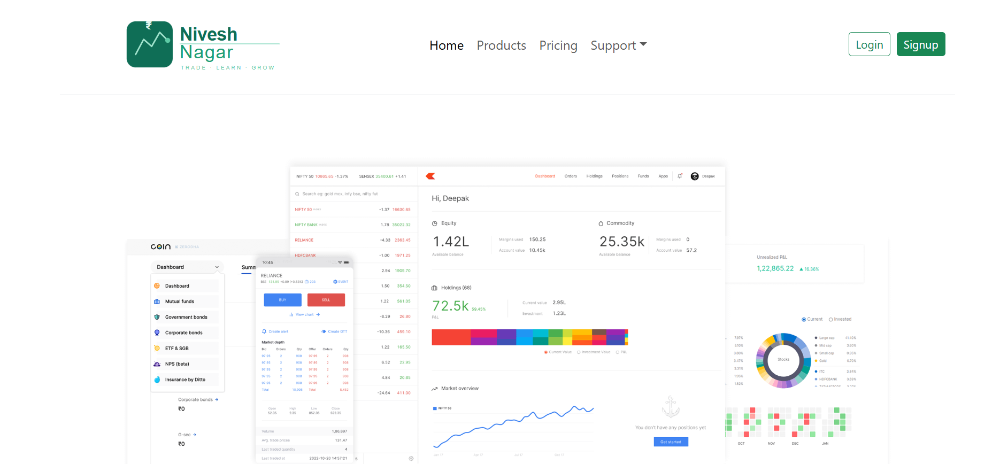
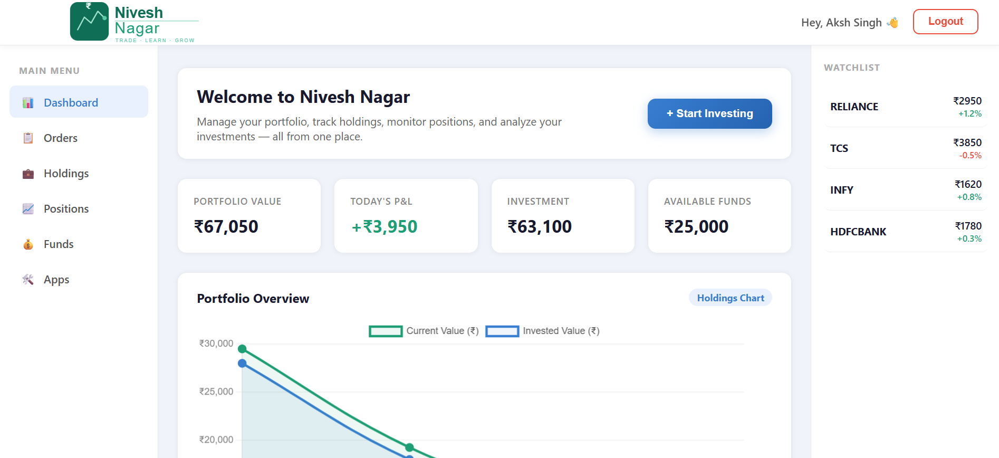
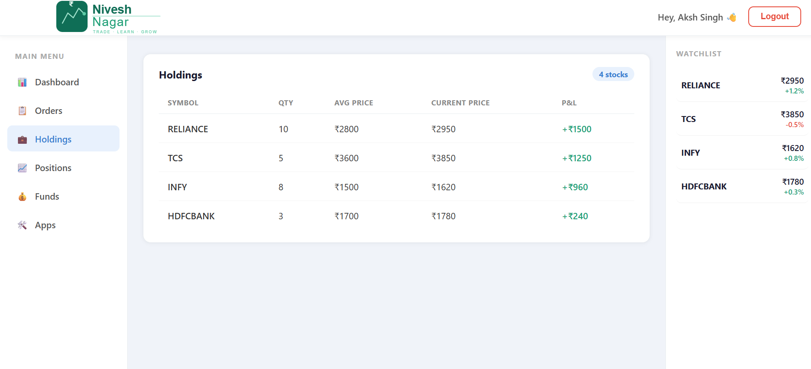

# 📈 Nivesh Nagar
A full-stack paper trading simulator inspired by Zerodha Kite.

## 🌐 Live Demo

- Frontend: https://nivesh-nagar-frontend.vercel.app
- Dashboard: https://nivesh-nagar-dashboard.vercel.app
- Backend: https://nivesh-nagar-backend.onrender.com

⏳ **Note:** Backend is hosted on Render's free tier — it may take 30-50 seconds to wake up if it hasn't been used recently. If login feels slow on first try, just wait a moment.

## 🚀 Features

- JWT Authentication — Signup, Login, Logout
- User-specific Portfolio — Holdings, Positions, Orders
- Buy/Sell stocks from Watchlist
- Real-time P&L calculation
- Portfolio Overview Chart (Chart.js)
- Multi-user support — every user sees only their data

## 📸 Screenshots

**Landing Page**

**Meet the Founder**

**Dashboard**

**Holdings**

## 🛠️ Tech Stack

- Frontend: React.js, React Router, Axios
- Dashboard: React.js, Chart.js, Material UI
- Backend: Node.js, Express.js
- Database: MongoDB Atlas (Mongoose)
- Auth: JWT, bcrypt

## 📂 Project Structure
nivesh-nagar/
├── frontend/ # Marketing website (React)
├── dashboard/ # Trading dashboard (React)
└── backend/ # REST API (Node + Express)

## ⚙️ Setup

### Backend
cd backend && npm install

Create a .env file with: MONGO_URI, JWT_SECRET, PORT
node index.js

### Frontend
cd frontend && npm install && npm start

### Dashboard
cd dashboard && npm install && npm start

## 👨‍💻 Made by Aksh Singh Bhadoria
